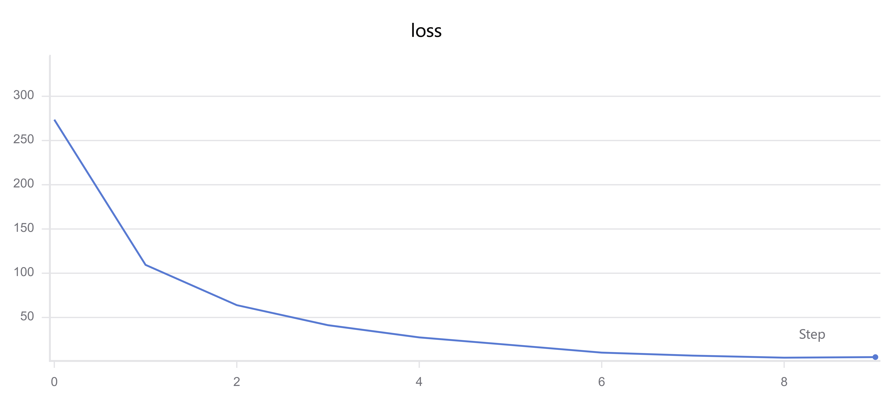
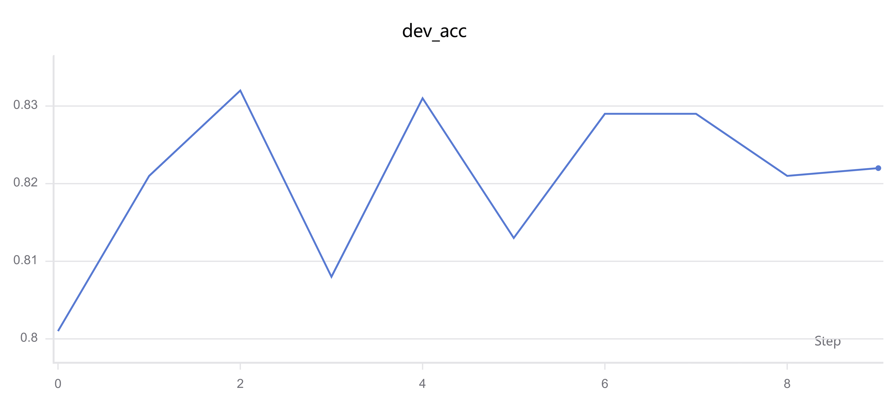

# Demo1：基于 BERT 的中文新闻文本分类

## 一、项目简介

本项目使用 **BERT + PyTorch** 实现中文新闻文本分类。

通过预训练 BERT 提取文本语义特征，再使用全连接层进行 15 类新闻分类。

主要技术：

* Python
* PyTorch
* Hugging Face Transformers
* BERT
* AdamW
* CrossEntropyLoss
* SwanLab

---

## 二、项目结构

```text
demo1/
├── config.py          # 项目配置
├── config.yaml        # 参数配置文件
├── dataset.py         # 数据集读取与文本处理
├── model.py           # BERT文本分类模型
├── train.py           # 模型训练、验证与测试
├── README.md          # 项目说明
│
├── data/              # 数据集
│   ├── train.txt
│   ├── dev.txt
│   └── test.txt
│
└── results/           # 实验结果
    ├── loss.png
    └── accuracy.png
```

---

## 三、模型结构

```text
中文新闻文本
      ↓
BertTokenizer
      ↓
BERT
      ↓
768维文本特征
      ↓
Dropout
      ↓
Linear（768 → 15）
      ↓
15类分类结果
```

其中使用预训练 BERT 提取文本特征，并通过全连接层完成最终分类。

---

## 四、数据处理

使用 `BertTokenizer` 将中文新闻文本转换为 BERT 可以处理的 `input_ids` 和 `attention_mask`。

通过 `collate_fn` 对 Batch 中不同长度的文本进行 Padding。

同时根据训练集建立统一的标签映射，将原始标签转换为连续的类别编号。

---

## 五、模型训练

模型使用：

* **优化器：AdamW**
* **损失函数：CrossEntropyLoss**
* **Dropout：0.3**
* **分类类别：15**

训练过程中使用训练集进行模型参数更新，并在验证集上计算 Accuracy。

训练结束后，在测试集上进行最终评估。

运行：

```bash
python train.py
```

---

## 六、实验结果

### 1. 测试集结果

| 指标            |         结果 |
| ------------- | ---------: |
| Test Accuracy | **0.83308** |

---

## 七、训练曲线

### Loss 曲线



### Dev Accuracy 曲线



训练过程使用 **SwanLab** 进行实验记录和可视化。

---

## 八、项目总结

本项目完成了一个基于 BERT 的中文新闻文本分类任务，实践了从：

**数据读取 → Tokenizer 编码 → BERT 特征提取 → 分类 → 模型训练 → 验证 → 测试**

的完整 NLP 文本分类流程。
